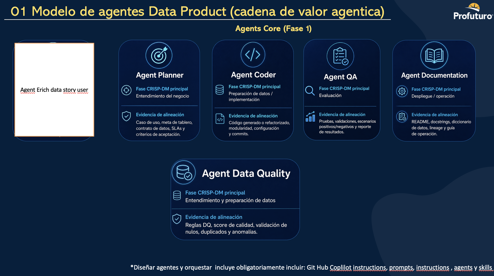

# Agentes de GitHub Copilot

## Descripción General

Este documento describe los agentes personalizados de GitHub Copilot para el proyecto DataLabLeague.

## Modelo de Agentes - Data Product (Cadena de Valor Agenticia)



**Referencia**: Profuturo - O1 Modelo de agentes Data Product (cadena de valor agenticia)

## Estrategia de Flujo

```
Caso de uso
    ↓
Data Story enriquecida (Agent 01)
    ↓
Data Governance (Agent 02) ⚠️ CHECKPOINT OBLIGATORIO
    ↓
Planner (Agent 03)
    ↓
Agentes Especializados (04-10)
    ↓
Evidencia & Deployment
```

## Agentes Disponibles (00-10)

### 00. Shared Context
**Directorio**: `agent-workflow/00-shared/`  
**Tipo**: Contexto compartido (no ejecutor)

Contenedor de contexto reutilizable entre todos los agentes.

**Artefactos**:
- `context.md` — Contexto general del proyecto
- `data-sources.md` — Catálogo de fuentes de datos
- `risk-register.md` — Registro de riesgos
- `business-kpis.md` — KPIs de negocio
- `glossary.md` — Glosario de términos

**Handoff**: → Todos los agentes

---

### 01. Enrich Data Story User Agent
**Directorio**: `agent-workflow/01-enrich-data-story-user/`  
**Fase CRISP-DM**: Business Understanding

Punto de entrada inicial. Especializado en enriquecimiento de historias de usuario de datos. Conecta necesidad de negocio, KPI, decisión, fuentes, granularidad, reglas DQ, criterios de aceptación y evidencia.

**Propósito**: Transformar casos de uso ambiguos en data stories ricas y listas para governance.

**Inputs**:
- Caso de uso del usuario (natural language)
- `agent-workflow/00-shared/context.md`

**Outputs**:
- `outputs/data-story-enriched.md`
- `outputs/planner-input.json` (preliminar)

**Handoff**: → Agent 02 Data Governance (OBLIGATORIO)

---

### 02. Data Governance Agent ⚠️
**Directorio**: `agent-workflow/02-agent-data-governance/`  
**Fase CRISP-DM**: Business Understanding / Data Understanding

**CHECKPOINT CRÍTICO**: Obligatorio entre Agent 01 y Agent 03.

**Propósito**: Validar y enriquecer el `planner-input.json` con governance: ownership, clasificación, PII, lineage, data contracts, controles de acceso.

**Inputs**:
- `inputs/planner-input.json` (preliminar de Agent 01)
- `agent-workflow/00-shared/risk-register.md`

**Outputs**:
- `outputs/governance-assessment.md`
- `outputs/data-classification.md`
- `outputs/planner-input.json` (gobernado) ← OUTPUT PRINCIPAL

**Quality Gates**:
- [ ] `governance.governance_approved: true`
- [ ] Data Owner asignado
- [ ] PII inventariado
- [ ] Riesgos evaluados

**Handoff**: → Agent 03 Planner (solo con aprobación)

---

### 03. Planner Agent
**Directorio**: `agent-workflow/03-agent-planner/`  
**Fase CRISP-DM**: Business Understanding / Data Understanding

Especializado en planificación técnica y diseño de arquitectura.

**Inputs**:
- `inputs/planner-input.json` (gobernado de Agent 02)
- `agent-workflow/00-shared/context.md`

**Outputs**:
- `outputs/execution-plan.json`
- `outputs/architecture-decision.md`
- `outputs/implementation-roadmap.md`

**Handoff**: → Agents 04-10 (según plan)

---

### 04. Coder Agent
**Directorio**: `agent-workflow/04-agent-coder/`  
**Fase CRISP-DM**: Data Preparation / Modeling / Implementation

Especializado en implementación de código y desarrollo.

**Inputs**:
- `inputs/execution-plan.json` (de Agent 03)

**Outputs**:
- Código implementado en `src/`
- `outputs/implementation-summary.md`

**Quality Gates**:
- [ ] PEP 8 compliance
- [ ] Type annotations
- [ ] Docstrings
- [ ] Error handling

**Handoff**: → Agent 05 QA

---

### 05. QA Agent
**Directorio**: `agent-workflow/05-agent-qa/`  
**Fase CRISP-DM**: Evaluation

Especializado en pruebas y aseguramiento de calidad.

**Inputs**:
- Código de Agent 04

**Outputs**:
- Tests en `tests/`
- `outputs/test-report.md`
- `outputs/coverage-report.md`

**Handoff**: → Agent 06 Data Quality

---

### 06. Data Quality Agent
**Directorio**: `agent-workflow/06-agent-data-quality/`  
**Fase CRISP-DM**: Data Understanding / Data Preparation

Especializado en calidad de datos y validación.

**Inputs**:
- `inputs/execution-plan.json`
- Governance de Agent 02

**Outputs**:
- `outputs/dq-rules.json`
- `outputs/validation-schema.json`
- `outputs/quality-dashboard-spec.md`

**Handoff**: → Agent 07 Documentation

---

### 07. Documentation Agent
**Directorio**: `agent-workflow/07-agent-documentation/`  
**Fase CRISP-DM**: Deployment / Operation

Especializado en generación de documentación.

**Inputs**:
- Código de Agent 04
- Tests de Agent 05

**Outputs**:
- README actualizado
- `outputs/data-dictionary.md`
- `outputs/lineage-diagram.md`
- `outputs/operations-guide.md`

**Handoff**: → Agent 08 Compliance & Security

---

### 08. Compliance & Security Agent
**Directorio**: `agent-workflow/08-agent-compliance-security/`

Especializado en cumplimiento normativo y seguridad.

**Inputs**:
- Código de Agent 04
- Governance de Agent 02

**Outputs**:
- `outputs/security-review.md`
- `outputs/compliance-checklist.md`
- `outputs/vulnerability-scan.md`

**Handoff**: → Agent 09 Deployment

---

### 09. Deployment Agent
**Directorio**: `agent-workflow/09-agent-deployment/`

Especializado en despliegue y delivery.

**Inputs**:
- Security review de Agent 08
- Código de Agent 04

**Outputs**:
- `outputs/deployment-plan.md`
- `outputs/rollback-procedure.md`
- `outputs/release-notes.md`

**Handoff**: → Agent 10 Monitoring

---

### 10. Monitoring Agent
**Directorio**: `agent-workflow/10-agent-monitoring/`

Especializado en observabilidad y monitoreo.

**Inputs**:
- Deployment de Agent 09
- Código de Agent 04

**Outputs**:
- `outputs/monitoring-dashboard.md`
- `outputs/alert-rules.yaml`
- `outputs/observability-config.md`

**Handoff**: → Evidence & Closure

---

## Reglas de Encadenamiento

### OBLIGATORIAS (Non-Negotiable)

1. **Entrada**: Todo caso de uso DEBE iniciar con Agent 01
2. **Governance Gate**: Agent 02 es OBLIGATORIO entre Agent 01 y Agent 03
3. **No Skip**: No se puede omitir Agent 02 bajo ninguna circunstancia
4. **Quality Gate**: `governance.governance_approved: true` requerido para avanzar
5. **Artefacto Gobernado**: Agent 03 consume `planner-input.json` de Agent 02, no de Agent 01

### Flujo Correcto ✅

```
01_enrich → 02_governance → 03_planner → 04-10
```

### Flujos Incorrectos ❌

```
01_enrich → 03_planner  (falta governance)
02_governance → 04_coder  (falta planner)
```

---

## Estructura de Directorios

Cada agente en `agent-workflow/` tiene:

```
XX-agent-name/
├── README.md
├── inputs/
├── outputs/
├── handoff/
└── evidence/
```

---

## Configuración

- **Agent Config**: `.github/agents/` (configuración de agentes)
- **Workflow**: `agent-workflow/` (estructura de directorios y artefactos)
- **Schemas**: `agent-workflow/schemas/` (validación de inputs/outputs)
- **Templates**: `agent-workflow/templates/` (plantillas reutilizables)

---

## Definition of Done

Una entrega está completa solo si tiene:

- [ ] Historia de usuario de datos enriquecida (Agent 01)
- [ ] **Governance aprobado** (Agent 02) con `governance_approved: true`
- [ ] Plan de ejecución (Agent 03)
- [ ] Código implementado (Agent 04)
- [ ] Tests ejecutados (Agent 05)
- [ ] Reglas Data Quality validadas (Agent 06)
- [ ] Documentación completa (Agent 07)
- [ ] Revisión de seguridad (Agent 08)
- [ ] Deployment preparado (Agent 09)
- [ ] Monitoreo configurado (Agent 10)
- [ ] Evidencia en GitHub
- [ ] Skills actualizados si se generó capacidad reutilizable

---

## Invocación de Agentes

### En GitHub Copilot Chat

```markdown
@01_enrich-data-story-user 
Quiero enriquecer este caso de uso: [descripción]
```

```markdown
@04_coder
Implementa esta función según el plan...
```

### Workflow Completo

```markdown
Ejecuta el workflow completo desde Agent 01 hasta Agent 10 para este caso de uso:
[descripción detallada]
```

---

**Última actualización**: 2026-06-28  
**Versión**: 3.0 (Agent Workflow Structure Aligned)

| ID | Agente | Directorio | Propósito | Handoff |
|---|---|---|---|---|
| **08** | Compliance & Security | `agent-workflow/08-agent-compliance-security/` | Cumplimiento | → 09 |
| **09** | Pipeline | `agent-workflow/09-agent-pipeline/` | Orquestación | → 10 |
| **10** | Observability | `agent-workflow/10-agent-observability/` | Monitoreo | → 11 (opcional) |
| **11** | Reviewer | `agent-workflow/11-agent-reviewer/` | Revisión final (read-only) | → Evidence |

---

## Reglas de Encadenamiento

### OBLIGATORIAS (Non-Negotiable)

1. **Entrada**: Todo caso de uso DEBE iniciar con `01_enrich-data-story-user`
2. **Governance Gate**: `02_data-governance` es **OBLIGATORIO** entre Agent 01 y Agent 03
3. **No Skip**: No se puede omitir Agent 02 bajo ninguna circunstancia
4. **Quality Gate**: `governance.governance_approved: true` requerido para avanzar a Agent 03
5. **Artefacto Gobernado**: Agent 03 consume `planner-input.json` de Agent 02, no de Agent 01

### Flujo Correcto ✅
````
This is the code block that represents the suggested code change:
```markdown
@01_enrich-data-story-user 
Quiero enriquecer este caso de uso: [descripción]
```
`````
This is the code block that represents the suggested code change:
```markdown
Necesito que el agente 05_coder implemente esta función...
```
``````
This is the code block that represents the suggested code change:
```markdown
Ejecuta el workflow completo desde 01 hasta 11 para este caso de uso:
[caso de uso detallado]
```
```````
This is the code block that represents the suggested code change:
```markdown
agent-workflow/
├── 00-shared/
│   ├── context.md
│   ├── data-sources.md
│   └── risk-register.md
├── 01-enrich-data-story-user/
│   ├── inputs/
│   ├── outputs/
│   │   ├── data-story-enriched.md
│   │   └── planner-input.json (preliminar)
│   ├── handoff/
│   └── evidence/
├── 02-agent-data-governance/ ⚠️
│   ├── inputs/
│   │   └── planner-input.json (preliminar) ← de Agent 01
│   ├── outputs/
│   │   ├── governance-assessment.md
│   │   ├── data-classification.md
│   │   ├── ...
│   │   └── planner-input.json (gobernado) ← OUTPUT PRINCIPAL
│   ├── handoff/
│   │   ├── handoff-to-agent-planner.md
│   │   └── handoff-to-agent-planner.json
│   └── evidence/
├── 03-agent-planner/
│   ├── inputs/
│   │   └── planner-input.json (gobernado) ← de Agent 02
│   ├── outputs/
│   │   ├── execution-plan.json
│   │   └── architecture-decision.md
│   └── ...
├── 04-agent-data-quality/
├── 05-agent-coder/
├── 06-agent-qa/
├── 07-agent-documentation/
├── 08-agent-compliance-security/
├── 09-agent-pipeline/
├── 10-agent-observability/
└── 11-agent-reviewer/
```
````````
This is the code block that represents the suggested code change:
```markdown
---

**Instrucciones para copiar**:

1. Abre [AGENTS.md](AGENTS.md) en tu editor
2. Selecciona todo el contenido (`Cmd+A`) y borra
3. Pega el primer bloque de código de arriba
4. Guarda el archivo

5. Abre [CLAUDE.md](CLAUDE.md) en tu editor
6. Selecciona todo el contenido (`Cmd+A`) y borra
7. Pega el segundo bloque de código de arriba
8. Guarda el archivo

✅ Ambos archivos estarán actualizados con la estructura completa de `agent-workflow` y el encadenamiento correcto de agentes.---

**Instrucciones para copiar**:

1. Abre [AGENTS.md](AGENTS.md) en tu editor
2. Selecciona todo el contenido (`Cmd+A`) y borra
3. Pega el primer bloque de código de arriba
4. Guarda el archivo

5. Abre [CLAUDE.md](CLAUDE.md) en tu editor
6. Selecciona todo el contenido (`Cmd+A`) y borra
7. Pega el segundo bloque de código de arriba
8. Guarda el archivo

✅ Ambos archivos estarán actualizados con la estructura completa de `agent-workflow` y el encadenamiento correcto de agentes.
```
