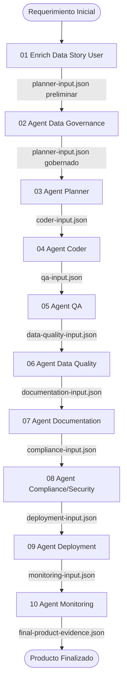

# Workflow Map — DataLab League Agent Chain

## Mapa Completo de la Cadena de Agentes

| # | Agente | Fase CRISP-DM | Input Principal | Output Principal | Siguiente Agente | Criterio de Handoff | Evidencia Mínima |
|---|---|---|---|---|---|---|---|
| 01 | Enrich Data Story User | Business Understanding / Data Understanding | requerimiento inicial, documentos fuente | planner-input.json (preliminar) | Agent Data Governance | Historia enriquecida completa, KPIs definidos, fuentes identificadas | Commit con planner-input.json |
| 02 | Agent Data Governance | Business Understanding / Data Understanding | planner-input.json (preliminar) | planner-input.json (gobernado) | Agent Planner | Clasificación datos, ownership, PII, lineage, data contracts definidos, aprobaciones firmadas | Commit con governance outputs + planner-input.json gobernado |
| 03 | Agent Planner | Data Understanding / Data Preparation | planner-input.json (gobernado) | coder-input.json | Agent Coder | Plan técnico aprobado, quality gates definidos, backlog completo | Commit con plan técnico |
| 04 | Agent Coder | Data Preparation / Modeling | coder-input.json | qa-input.json | Agent QA | Código implementado, archivos modificados documentados | PR con código |
| 05 | Agent QA | Modeling / Evaluation | qa-input.json | data-quality-input.json | Agent Data Quality | Tests ejecutados, cobertura ≥80%, sin defectos P0 abiertos | Reporte de tests |
| 06 | Agent Data Quality | Data Preparation / Evaluation | data-quality-input.json | documentation-input.json | Agent Documentation | DQ score ≥98%, reglas validadas, control totals reconciliados | Reporte DQ |
| 07 | Agent Documentation | Deployment | documentation-input.json | compliance-input.json | Agent Compliance/Security | Documentación funcional + técnica completa, diccionario de datos | Archivos de documentación |
| 08 | Agent Compliance/Security | Evaluation / Deployment | compliance-input.json | deployment-input.json | Agent Deployment | OWASP checklist completo, LFPDPPP revisado, `deployment_approved: true` | Security review aprobado |
| 09 | Agent Deployment | Deployment | deployment-input.json | monitoring-input.json | Agent Monitoring | Deployment plan aprobado, release notes, rollback plan | Evidencia de despliegue |
| 10 | Agent Monitoring | Monitoring & Improvement | monitoring-input.json | final-product-evidence.json | Fin del ciclo | KPIs operativos definidos, alertas configuradas, mejora continua documentada | final-product-evidence.json |

---

## Diagrama de Flujo

---

## Nota Especial: Agent Data Governance como Validador

Agent Data Governance (paso 02) es un **nodo obligatorio de validación** entre la historia de usuario enriquecida y la planificación técnica.

Su artefacto de salida (`planner-input.json` gobernado) debe contener **los mismos campos** que el input más los campos de gobierno:

- `governance.data_classification`
- `governance.data_ownership`
- `governance.pii_fields`
- `governance.data_contracts`
- `governance.access_control`
- `governance.regulatory_risks`
- `governance.approved_by`

---

## Reglas de Trazabilidad

1. Todo artefacto tiene `version` en formato `MAJOR.MINOR`.
2. Todo handoff tiene `status` con valor `ready_for_next_agent` antes de transferir.
3. Todo output tiene referencia a evidencia en GitHub (commit, PR, issue).
4. Si un agente detecta un bloqueante, actualiza `00-shared/open-questions.md` y **no avanza** hasta resolver.
5. El campo `requires_human_review: true` implica aprobación manual antes de continuar.

---

## Reglas de Versionamiento

| Cambio | Acción |
|---|---|
| Corrección menor (typo, dato) | MINOR +1 (ej: 1.0 → 1.1) |
| Cambio funcional o de alcance | MAJOR +1 (ej: 1.1 → 2.0) |
| Rehacer por rechazo | MAJOR +1 |
| Re-revisión sin cambios | Sin cambio de versión |

---

## Reglas de Evidencia

- Todo commit relacionado con un artefacto debe referenciar el ID del artefacto.
- Todo PR debe completar el checklist de Agent Workflow.
- La evidencia se registra en `XX-agent-name/evidence/` y en `evidence/evidence-index.md`.
