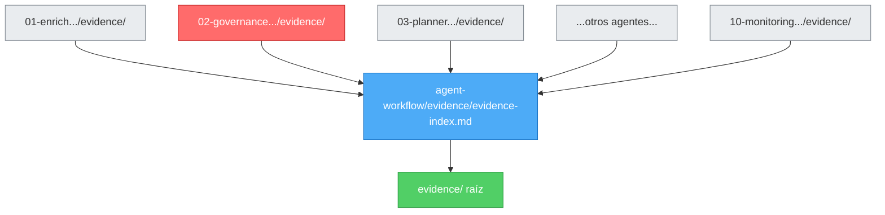

# Arquitectura de Evidencia — DataLab League

## Propósito

Este documento define la arquitectura de evidencia del proyecto DataLab League, explicando la relación entre las tres carpetas de evidencia y su propósito.

---

## Tres Niveles de Evidencia

### 1️⃣ Evidencia Granular (por agente)

**Ubicación**: `agent-workflow/XX-agent-name/evidence/`

**Propósito**: Trazabilidad detallada de ejecución de cada agente individual

**Contenido**:
- Logs de ejecución del agente
- Decisiones tomadas durante el proceso
- Outputs intermedios
- Artefactos específicos del agente
- Documentos de handoff

**Ejemplo**:
```
agent-workflow/
├── 01-enrich-data-story-user/evidence/
│   ├── README.md
│   ├── execution-log-2026-06-28.md
│   ├── kpi-mapping.md
│   └── handoff-to-02-governance.md
├── 02-agent-data-governance/evidence/
│   ├── README.md
│   ├── governance-approvals.md
│   ├── data-classification-decisions.md
│   └── pii-inventory.md
...
```

**Audiencia**: Equipo de desarrollo, auditores de proceso

---

### 2️⃣ Tracking Operativo (workflow)

**Ubicación**: `agent-workflow/evidence/`

**Propósito**: Índice central de evidencia del workflow completo

**Contenido**:
- `evidence-index.md` — Registro EVD-001 a EVD-010
- Estado de fases CRISP-DM
- Referencias a commits/PRs de cada agente
- Tracking de cierre de ciclo
- `final-product-evidence.json`

**Ejemplo**:
```
agent-workflow/evidence/
├── README.md
├── evidence-index.md          ← ÍNDICE CENTRAL
└── final-product-evidence.json (cuando se complete el ciclo)
```

**Audiencia**: Project Manager, Tech Lead, auditores de calidad

---

### 3️⃣ Presentación Final (raíz)

**Ubicación**: `evidence/` (raíz del repositorio)

**Propósito**: Evidencia consolidada para evaluación DataLab League

**Contenido**:
- `data-story.md` — Narrativa del proyecto
- `skills.md` — Competencias demostradas
- `testing.md` — Validación de calidad
- `data-quality.md` — Métricas DQ
- `governance.md` — Cumplimiento normativo
- `demo.md` — Demostración funcional

**Ejemplo**:
```
evidence/
├── README.md
├── data-story.md       ← Para jurados
├── skills.md           ← Competencias demostradas
├── testing.md          ← Validación de calidad
├── data-quality.md     ← Métricas DQ
├── governance.md       ← Cumplimiento
└── demo.md             ← Demo funcional
```

**Audiencia**: Jurados, evaluadores, stakeholders de DataLab League

---

## Flujo de Evidencia



**Leyenda**:
- 🔴 **Rojo**: Agent 02 Data Governance (CHECKPOINT CRÍTICO)
- 🔵 **Azul**: Tracking operativo (índice central)
- 🟢 **Verde**: Presentación final (evaluación)

---

## Relación Entre Niveles

| Nivel | Tipo | Actualización | Versionado | Backup |
|---|---|---|---|---|
| **Granular** | Operativo | Por agente | Git | Automático |
| **Tracking** | Operativo | Continuo | Git | Automático |
| **Presentación** | Entregable | Final/Hitos | Git | Automático |

---

## Reglas de Mantenimiento

### DO ✅

1. **Granular**: Documentar CADA ejecución de agente
2. **Tracking**: Actualizar `evidence-index.md` después de cada agente
3. **Presentación**: Consolidar evidencia al final de cada sprint/hito
4. **Versionado**: Usar Git para todo
5. **Referencias**: Incluir SHA commits en tracking operativo

### DON'T ❌

1. **NO mezclar** evidencia granular con presentación final
2. **NO duplicar** contenido entre niveles (usar referencias)
3. **NO omitir** evidencia de Agent 02 Data Governance (crítico)
4. **NO avanzar** a Agent 03 sin `governance_approved: true`
5. **NO olvidar** actualizar `evidence-index.md` después de cada agente

---

## Checklist de Evidencia Completa

### Por Agente (Granular)
- [ ] README.md actualizado con contenido del agente
- [ ] Logs de ejecución registrados
- [ ] Decisiones documentadas
- [ ] Handoff completado

### Workflow (Tracking)
- [ ] `evidence-index.md` actualizado con entrada EVD-XXX
- [ ] SHA commit registrado
- [ ] Estado de fase CRISP-DM actualizado
- [ ] Referencias a PRs/commits incluidas

### Proyecto (Presentación)
- [ ] `data-story.md` completo y actualizado
- [ ] `skills.md` con competencias demostradas
- [ ] `testing.md` con resultados de validación
- [ ] `data-quality.md` con métricas DQ
- [ ] `governance.md` con cumplimiento normativo
- [ ] `demo.md` con instrucciones de demostración

---

## Ejemplo de Flujo Completo

### Paso 1: Agente ejecuta
```bash
# Agent 01 ejecuta
outputs/data-story-enriched.md
outputs/planner-input.json (preliminar)
handoff/handoff-to-agent-governance.json
```

### Paso 2: Evidencia granular
```bash
agent-workflow/01-enrich-data-story-user/evidence/
├── execution-log-2026-06-28.md      ← Creado
├── kpi-mapping.md                   ← Creado
└── handoff-to-02-governance.md      ← Creado
```

### Paso 3: Registro en tracking
```bash
# Actualizar evidence-index.md
EVD-001 | 01-enrich | commit | a1b2c3d | 2026-06-28 | Data story enriquecida | ✅ Completo
```

### Paso 4: Consolidación final
```bash
# Al final del sprint, actualizar
evidence/data-story.md               ← Consolidar narrativa
evidence/skills.md                   ← Agregar skill de enriquecimiento
```

---

## Referencias

- [README de Evidencia Granular (Agent 01)](agent-workflow/01-enrich-data-story-user/evidence/README.md)
- [README de Evidencia Granular (Agent 02)](agent-workflow/02-agent-data-governance/evidence/README.md)
- [README de Tracking Operativo](agent-workflow/evidence/README.md)
- [README de Presentación Final](evidence/README.md)
- [Índice de Evidencia](agent-workflow/evidence/evidence-index.md)

---

**Última actualización**: 2026-06-28  
**Versión**: 1.0  
**Estado**: Documentación inicial
